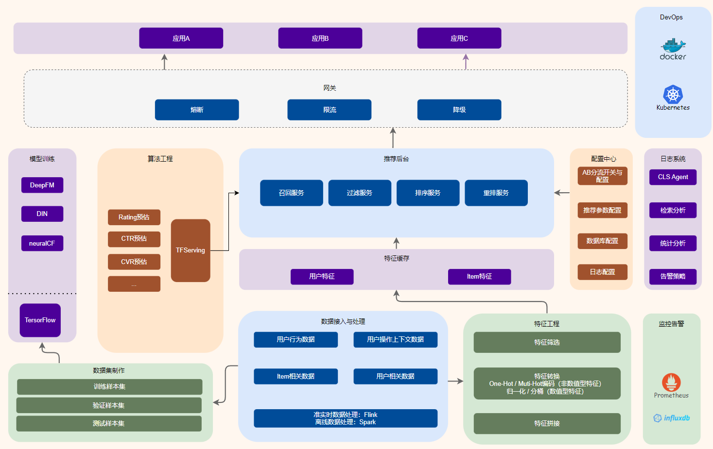

# simple-recommender-system
一个简单的推荐系统

# 基础架构图


# 原始数据源
http://www2.informatik.uni-freiburg.de/~cziegler/BX/
使用了其中三个数据源文件：BX-Users、BX-Books、BX-Book-Ratings


# 原始数据源的处理
1. 将BX-Users源数据中的字段修改名称后写入到users文件中。
2. 将BX-Books数据源中的字段修改名称并增加了一个自增ID后，写入到了books文件中。
3. 因为BX-Book-Ratings数据源中缺少了用户的场景信息，因此，将ratings中的时间戳信息合并到了该数据源中，并生成了book_ratings文件，
作为用户评分的原始数据源。

# 生成训练以及测试数据集
训练数据集：
测试数据集：

# 环境准备
## Tensorflow

# embedding
src/embedding/embedding.py 中做了item2vec的embedding过程示例。
可以看到，先对原始数据集进行了初步处理，将评分低于6分的过滤掉，并将剩余的Item按照评分大小进行排序，得到了每个用户针对Item的序列数据。
将以上数据送入mllib的Word2Vec函数进行处理。即可获得指定维度的向量了。

# 模型构建
构建模型的五个步骤：特征选择、模型设计、模型实现、模型训练、模型评估。
## Embedding+DNN
### 特征选择
|  特征分类   | 特征名称  | 特征字段  | 特征类别  | 处理方式  |
|  ----  | ----  | ----  | ----  | ----  |
| 用户特征  | 用户ID | User-ID | 类别型 | onehot+embedding |
| 用户特征  | 用户位置 | Location | 类别型 | onehot+embedding |
| 用户特征  | Age | Location | 类别型 | onehot+embedding |
| Item特征  | 图书索引 | ISBN | 类别型 | onehot+embedding |
| Item特征  | 书名 | Book-Title | 类别型 | onehot+embedding |
| Item特征  | 作者 | Book-Author | 类别型 | onehot+embedding |
| Item特征  | 发布年份 | Year-Of-Publication | 数值型 | 直接输入DNN |
| Item特征  | 出版方 | Publisher | 类别型 | onehot+embedding |
| 场景特征  | 评价时间 | timestamp | 数值型 | 直接输入DNN |
### 模型设计
选择了一个三层的MLP结构，其中前两层是128维的全连接层，最后一层采用单个sigmoid神经元作为输出层。
### 模型实现
参看embedding_dnn.py文件代码实现。
### 模型训练结果

# 关于Keras
Keras 是一个用 Python 编写的高级神经网络 API，它能够以 TensorFlow, CNTK, 或者 Theano 作为后端运行。Keras 的开发重点是支持快速的实验。能够以最小的时延把你的想法转换为实验结果，是做好研究的关键。

简单来说，就是Keras提供了一个很方便的API接口，让我们可以高效的使用Tensorflow，且在2017年，Google的TensorFlow团队已在TensorFlow核心库中支持了Keras。

Keras官方网站：https://keras.io/
# 模型训练的结果
在训练完毕后，可以将模型保存起来，供在线推荐服务（如TFServing）加载使用。Python语句如：
```
tf.keras.models.save_model(
    model,
    model_save_path + "/20230216",
    overwrite=True,
    include_optimizer=True,
    save_format=None,
    signatures=None,
    options=None
)
```

保存到的目录中至少会有2个文件（目录）。其中：
`saved_model.pb`文件用于存储实际 TensorFlow 程序或模型，以及一组已命名的签名——每个签名标识一个接受张量输入和产生张量输出的函数。

`variables`目录下是一个或多个包含了模型权重的分片，格式一般为`variables.data-00000-of-00001`，还有一个用于存储哪些权重存储在哪些分片的索引文件，文件名称一般为`variables.index`。

用一句话概括的话，`saved_model.pb`存储模型，`variables`存储权重。


Test Loss -1.0968728878302678e+20, Test Accuracy 0.0014199770521372557, Test ROC AUC 0.5, Test PR AUC 0.37431004643440247